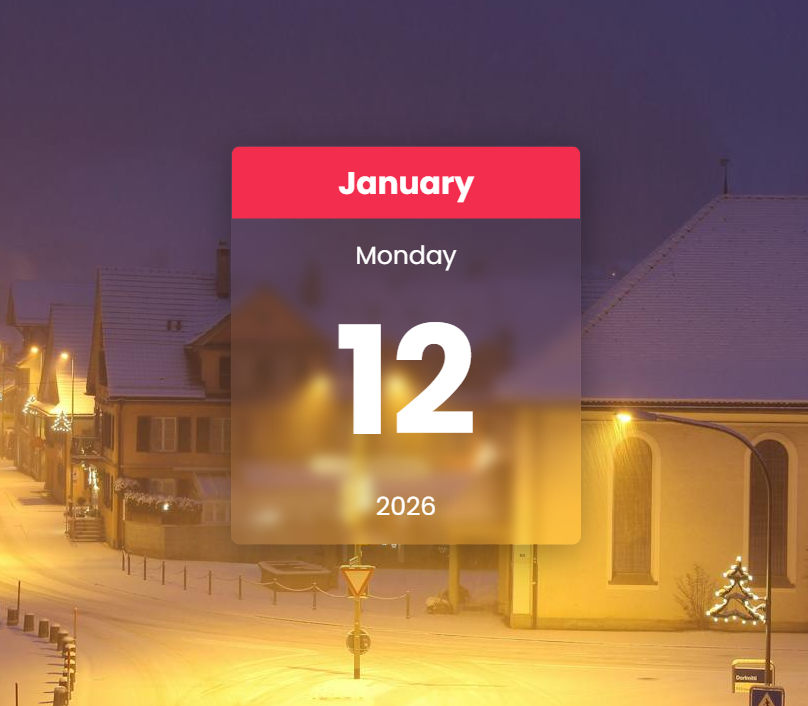

# Glassmorphism Calendar

A clean and modern **Glassmorphism-style calendar UI** built using HTML, CSS, and JavaScript. This project showcases a visually appealing calendar interface with a frosted-glass aesthetic and smooth interactions.

## 📌 Overview

This is a frontend UI page that displays a calendar with a **glassmorphism effect**, making use of transparent glass-like panels, soft shadows, and vibrant highlights for a modern look. The project is ideal for learning UI design trends and practicing JavaScript DOM manipulation.

## 🔍 Features

- ✨ **Glassmorphism UI design**
- 📅 Dynamic calendar generation using JavaScript
- 📍 Highlights current date
- 🎨 Smooth hover and interactive effects
- ✅ Fully responsive layout

## 🧠 Tech Stack

| Technology | Purpose |
|------------|---------|
| `HTML`     | Structure |
| `CSS`      | Styling & Glassmorphism effects |
| `JavaScript` | Calendar logic & interactivity |

## 📁 Project Structure

```
Glassmorphism_Calender/
├── index.html
├── styles.css
├── script.js
├── 12.png ← Screenshot / preview image
└── README.md
```


## 🚀 Getting Started

Follow these steps to run the project locally:

1. **Clone the repository**
   ```
   git clone https://github.com/suyXcode/Glassmorphism_Calender.git
   ```

2. **Open the project folder**
```
cd Glassmorphism_Calender
```

3. **Launch it in your browser**

- Double-click index.html
- Right-click → Open With → Your Browser


## 📸 Preview



## 🤝 Contributing

**Contributions, improvements, and design enhancements are welcome!**
To contribute:

- - Fork the repository
- - Create your feature branch (git checkout -b feature/XYZ)
- - Commit your changes
- - Push to your branch
- - Open a Pull Request


